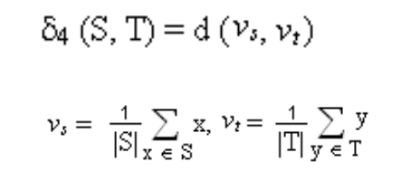
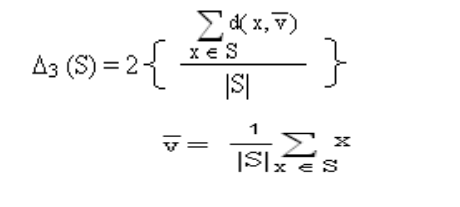
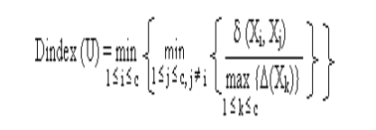

# Cluster-Validation #

:triangular_flag_on_post: Many interesting algorithms applied to
analyze very large datasets. Most algorithms don’t provide any means for its validation and evaluation. So it is very difficult to conclude which are the best clusters and should be taken for analysis. Whatever the intention of clustering may be, the number of clusters sought is always unknown (more or less). Some internal measures:

:heavy_check_mark: Compactness

:heavy_check_mark: Connectedness

:heavy_check_mark: Separation

:heavy_check_mark: Combination

## Internal measures ##

## Optimal Clusters ##

:triangular_flag_on_post: There are several robust strategies for predicting optimal clusters:

:heavy_check_mark: silhouette index

:heavy_check_mark: Dunn’s index

:heavy_check_mark: Davies-Bouldin (DB) index

:heavy_check_mark: Xie-Beni (XB) index

:heavy_check_mark: I-index

:heavy_check_mark: CS-index

## Distance ##

Calculate a distance between 2 points p (x1, y1) and q (x2, y2) in XY-plane.

:heavy_check_mark: Euclidean distance

:heavy_check_mark: Chebyshev distance

:heavy_check_mark: Manhattan distance

:heavy_check_mark: Mahalanobis distance

:heavy_check_mark: Minkowski distance

### Intercluster Distance ###

:triangular_flag_on_post: Let S and T are clusters formed using partition U. d(x, y) is the distance between two objects x and y belonging to S and T respectively. d (x, y) is calculated using well known metrics such as Euclidean, Manha:an and Chebychev. |S|
and |T| are the number of objects in clusters S and T respectively.

The single linkage distance is the closest distance between two objects belonging to two different clusters defined as:-

The complete linkage distance represents the distance between the most remote objects belonging to two different clusters, given as:-

The average linkage distance defines the average distance between all the objects belonging to two different clusters, described as:-

The centroid linkage distance reflects the distance between the centers vs and vt of two clusters S and T respec9vely, presented below:-

The average of centroids linkage represents the distance between the center of a cluster and all the objects belonging to a different
cluster, explained as:-

### Intracluster distance ###

:triangular_flag_on_post: There are basically three types of intracluster
distances:
The complete diameter distance is the distance between the most remote objects belonging to the same cluster, as given below:-

The average diameter distance represents the average distance between all the objects belonging to the same cluster, as defined
below:-

The centroid diameter distance defines the double average distance between all of the objects and the cluster’s center, as illustrated below:-

###Dunn’s Index ###

:triangular_flag_on_post: The Dunn’s valida9on index, DIndex, is defined as:

δ (Xi, Xj) is the intercluster distance i.e. the distance between cluster Xi and Xj and Δ(Xk) is the intracluster distance of cluster Xk i.e. distance within the cluster Xk.

The goal is to maximize the intercluster distances and minimizing the intracluster distances. The large values of Dindex corresponds to good quality cluster. Thus the number of clusters that maximizes DIndex is taken as the op9mal number of clusters k

### Davies-Bouldin index DBIndex ###

:triangular_flag_on_post: Davies-Bouldin Index finds the set of clusters that are compact and well separated. The Davies-Bouldin index DBIndex is defined as:

### References ###
[Link 1] (https://www.datanovia.com/en/lessons/cluster-validation-statistics-must-know-methods/)

[Link 2] (https://www.youtube.com/watch?v=d8MgdChSdyE)