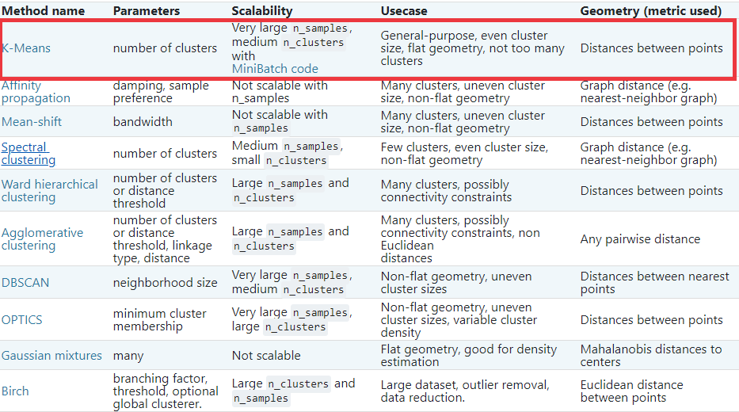

## Clustering ##

 Before talking especifically about the K-means, it's good to know about the process of clustering. Each clustering algorithm comes in two variants: a class, that implements the fit method to learn the clusters on train data, and a function, that, given train data, returns an array of integer labels corresponding to the different clusters. For the class, the labels over the training data can be found in the labels_ attribute.

## K-means ##

K Means is an algorithm for unsupervised clustering: that is, finding clusters in data based on the data attributes alone (not the labels).

K Means is a relatively easy-to-understand algorithm. It searches for cluster centers which are the mean of the points within them, such that every point is closest to the cluster center it is assigned to.

The KMeans algorithm clusters data by trying to separate samples in n groups of equal variance, minimizing a criterion known as the inertia or within-cluster sum-of-squares (see below). This algorithm requires the number of clusters to be specified. It scales well to large number of samples and has been used across a large range of application areas in many different fields.

The k-means algorithm divides a set of N samples X  into  K disjoint clusters C, each described by the mean uj
of the samples in the cluster. The means are commonly called the cluster “centroids”; note that they are not, in general, points from X , although they live in the same space.

The K-means algorithm aims to choose centroids that minimise the inertia, or within-cluster sum-of-squares criterion:

Inertia can be recognized as a measure of how internally coherent clusters are. It suffers from various drawbacks:

-> Inertia makes the assumption that clusters are convex and isotropic, which is not always the case. It responds poorly to elongated clusters, or manifolds with irregular shapes.

-> Inertia is not a normalized metric: we just know that lower values are better and zero is optimal. But in very high-dimensional spaces, Euclidean distances tend to become inflated (this is an instance of the so-called “curse of dimensionality”). Running a dimensionality reduction algorithm such as Principal component analysis (PCA) prior to k-means clustering can alleviate this problem and speed up the computations.

The k-means clustering algorithm attempts to split a given anonymous data set (a set containing no information as to class identity) into a fixed number (k) of clusters.

### :large_blue_diamond: How does it work? ###

Initially k number of so called centroids are chosen. A centroid is a data point (imaginary or real) at the center of a cluster. In Praat each centroid is an existing data point in the given input data set, picked at random, such that all centroids are unique (that is, for all centroids ci and cj, ci ≠ cj). These centroids are used to train a kNN classifier. The resulting classifier is used to classify (using k = 1) the data and thereby produce an initial randomized set of clusters. Each centroid is thereafter set to the arithmetic mean of the cluster it defines. The process of classification and centroid adjustment is repeated until the values of the centroids stabilize. The final centroids will be used to produce the final classification/clustering of the input data, effectively turning the set of initially anonymous data points into a set of data points, each with a class identity.

### :large_blue_diamond: Advantages of k-means ###

    Relatively simple to implement.

    :heavy_check_mark: Scales to large data sets.

    :heavy_check_mark: Guarantees convergence.

    :heavy_check_mark: Can warm-start the positions of centroids.

    :heavy_check_mark: Easily adapts to new examples.

    :heavy_check_mark: Generalizes to clusters of different shapes and sizes, such as elliptical clusters.

### :large_blue_diamond: Disadvantages of k-means ###

    :x: Choosing k manually.

    :x: Being dependent on initial values.

    :x: Clustering data of varying sizes and density.

    :x: Clustering outliers.

    :x: Scaling with number of dimensions.

#### Do you want to learn more? Click here. ####
 [K-means Wikipedia page](https://en.wikipedia.org/wiki/K-means_clustering)

 
:arrow_lower_right: References:

[Link 1](https://github.com/jakevdp/sklearn_pycon2015/blob/master/notebooks/04.2-Clustering-KMeans.ipynb)

[Link 2](https://en.wikipedia.org/wiki/K-means_clustering)

[Link 3](https://www.fon.hum.uva.nl/praat/manual/k-means_clustering_1__How_does_k-means_clustering_work_.html#:~:text=The%20k%2Dmeans%20clustering%20algorithm,number%20(k)%20of%20clusters.&text=A%20centroid%20is%20a%20data,the%20center%20of%20a%20cluster)

