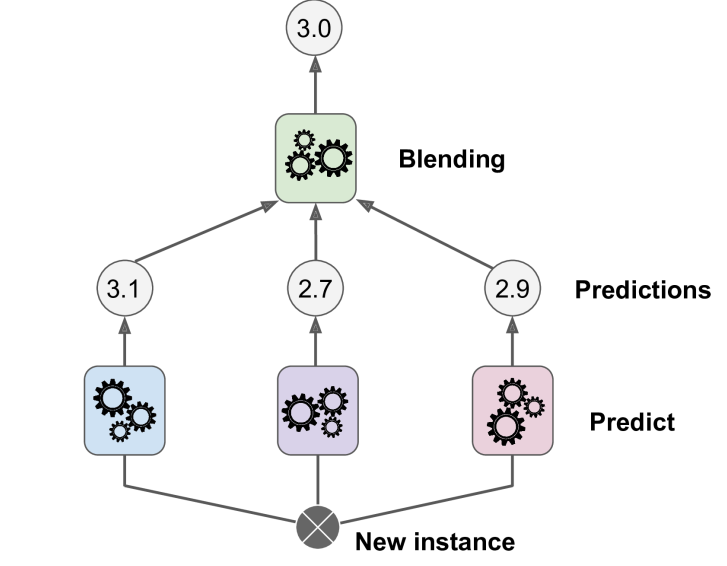
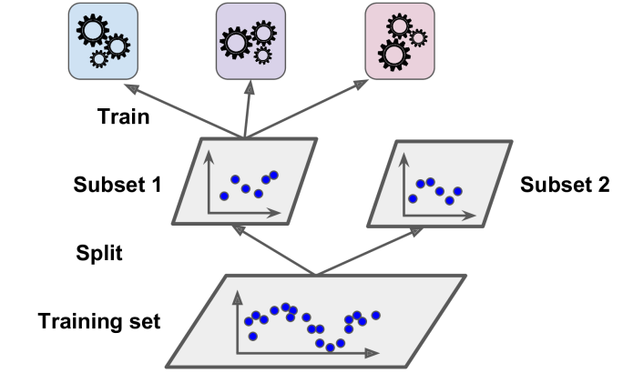
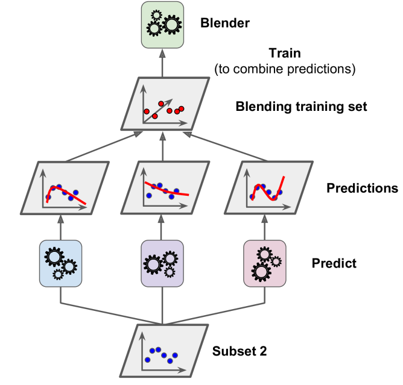
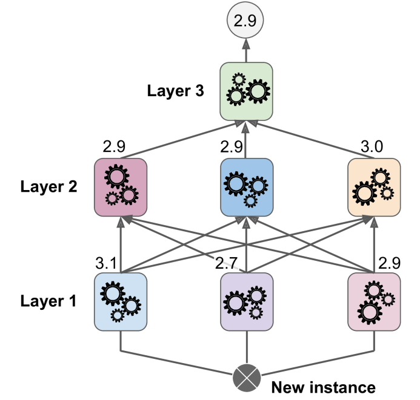

# Stacking

Suppose you ask a complex question to thousands of random people, then aggregate their answers. In many cases you will find that this aggregated answer is better than an expert’s answer. This is called the wisdom of the crowd. Similarly, if you aggregate the predictions of a group of predictors (such as classifiers or regressors), you will often get better predictions than with the best individual predictor. A group of predictors is called an ensemble; thus, this technique is called Ensemble Learning, and an Ensemble Learning algorithm is called an Ensemble method.

Stacking is one of these methods, it is based on a simple idea: instead of using trivial functions (such as hard voting) to aggregate the predictions of all predictors in an ensemble, why don’t we train a model to perform this aggregation? Like shown in the following figures each of the bottom three predictors predicts a different value, and then the final predictor (called a blender, or a meta learner) takes these predictions as inputs and makes the
final prediction.

To train the blender, a common approach is to use a hold-out set. Let’s see how it works. First, the training set is split in two subsets. The first subset is used to train the predictors in the first layer.

Next, the first layer predictors are used to make predictions on the second (held-out) set. This ensures that the predictions are “clean,” since the predictors never saw these instances during training. Now for each instance in the hold-out set there are three predicted values. We can create a new training set using these predicted values as input features (which makes this new training set three-dimensional), and keeping the target values. The blender is trained on this new training set, so it learns to predict the target value given the first layer’s predictions.

It is actually possible to train several different blenders this way (e.g., one using Linear Regression, another using Random Forest Regression, and so on): we get a whole layer of blenders. The trick is to split the training set into three subsets: the first one is used to train the first layer, the second one is used to create the training set used to train the second layer (using predictions made by the predictors of the first layer), and the third one is used to create the training set to train the third layer (using predictions made by the predictors of the second layer). Once this is done, we can make a prediction for a new instance by going through each layer sequentially.

#### For more information/examples see
- https://machinelearningmastery.com/stacking-ensemble-machine-learning-with-python/
- https://blog.statsbot.co/ensemble-learning-d1dcd548e936
- https://bradleyboehmke.github.io/HOML/stacking.html
- https://www.kaggle.com/arthurtok/introduction-to-ensembling-stacking-in-python

### References

Geron, A. (2019). Hands-On Machine Learning with Scikit-Learn, Keras, and TensorFlow: Concepts, Tools, and Techniques to Build Intelligent Systems. O'Reilly Media, )Incorporated.
